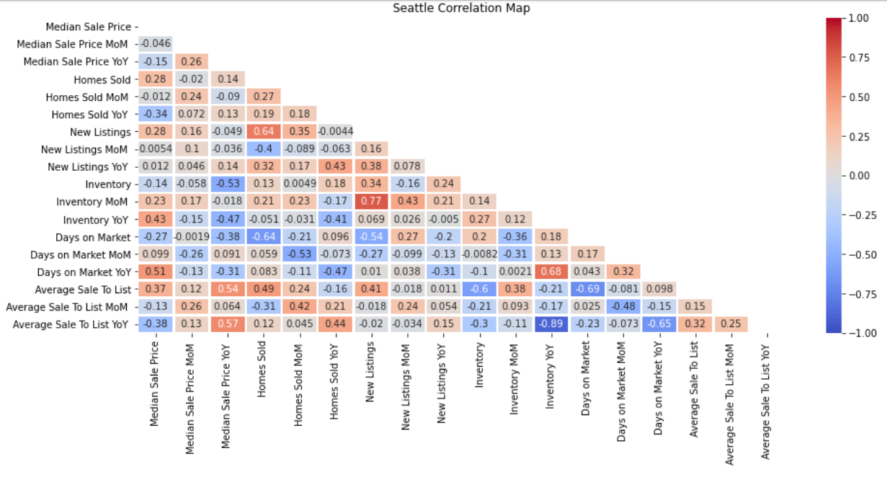

# Property Predictions

Predictive modeling of Real Estate using Machine Learning and dimensionality reduction

## Data Analysis on Redfin sales data to explore predictive possibilities

### By [Sravani](https://github.com/sravani61), [Lee](https://github.com/hageslel), [Roman](https://github.com/rrivera94), and [Siege](https://github.com/CapraRoyale)

### Data Source and Objective

Using monthly sales data from [RedFin](https://www.redfin.com/news/data-center/) spanning 2012-2020, we wanted to explore relationships between the Median Sales Prices of homes in any given neighborhood of Seattle, and meta-data about related sales. This included the number of new sales on the market, the total inventory of homes, and the length of time the average home was for sale, among other measures.

### Discoveries

The bulk of our research was done in Data Exploration by running a variety of models to find correlations and determine if there was any meaningful predicatability. As we discovered, there was very little correlation between the majority of measures, and the few that existed were self-referential.

### Seattle City Analysis 

As a first step, analysis was done soley on Seattle city data (non-neighborhood specific).  Predictive modeling was done using ARMA, ARIMA, LSTM RNN, Linear Regression, Balanced Random Forest, and Random Forest models.  All models utilized median home sale price data as the target variable.  On models that required training and testing, a 70/30 train/test split was utilized.  As the data analyzed was time series data, the data was not shuffled to ensure model accuracy and consistency.  

After compiling and running all models it was found that no models offered strong predictive capabilities.  When analyzing the features importances of the Balanced Random Forest and Randome Forest models it was interesting to notice differences.  The top two features for the Balanced Random Forest model were new listings and inventory, whereas the top two features for the Random Forest model were inventory and average sale to list.  Images of model predictions vs. actual values, features importance graphs, and numerous other visual graphics can be found in the Images folder for reference.  

One final interesting finding from analyzing Seattle city data was in the similarities and differences of the predictions of the LSTM, Linear Regression, Balanced Random Forest, and Random Forest models.  As can be seen via the image below, three of the four models predicted similarly.  The LSTM model predicted the most accurately, but all predictions hovered around $700K.  

### Neighborhood Analysis

After modeling the data using ARMA, ARIMA, LSTM, and Regression for Seattle city as a whole, there was no significant predicting capacity for home prices. So, the project scope was extended to model each neighborhood in the city separately. After doing a standard deviation on the median price data, five least and most volatile neighborhoods werre picked to analyse.

The neighborhoods analysed were:

Least Volatile:

1. Belltown
2. Broadway
3. International District
4. Pinehurst
5. Dunlap

Most Volatile:

1. Laurelhurst
2. Madison Park
3. Portage Bay
4. Seattle Central District
5. Denny Blaine

After doing a balanced random forest features importances analysis, there were interesting deductions made:

Most important features for

Low Volatile neighborhoods:

1. Average Sale Price to List Price
2. Inventory

High Volatile neighborhoods:

1. Average Sale Price to List Price
2. Days on Market

Least important features for

Low Volatile neighborhoods:

1. Homes Sold
2. Days on Market

High Volatile neighborhoods:

1. New Listings
2. Inventory

The images relating to the model performance and correlations are presented in the images folder for reference.

### Conclusions

Given the dataset, no real meanignful connections can be made, however we posit that a few extra datapoints may produce more meaningful relationships. For example, the average salary of neighborhood residents would likely result in stronger correlations for Median Sales Price of a home in any given neighborhood.
In addition, fundamental details about houses in each neighborhood would be helpful to predict Median Sales Price, details such as room count, number of floors, floor area, year built, etc.
